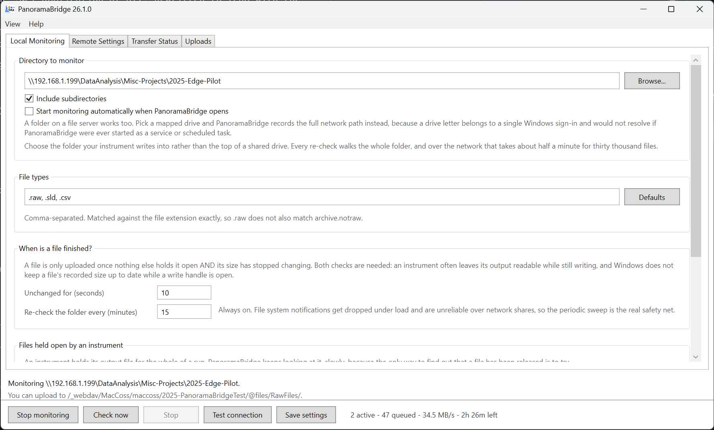
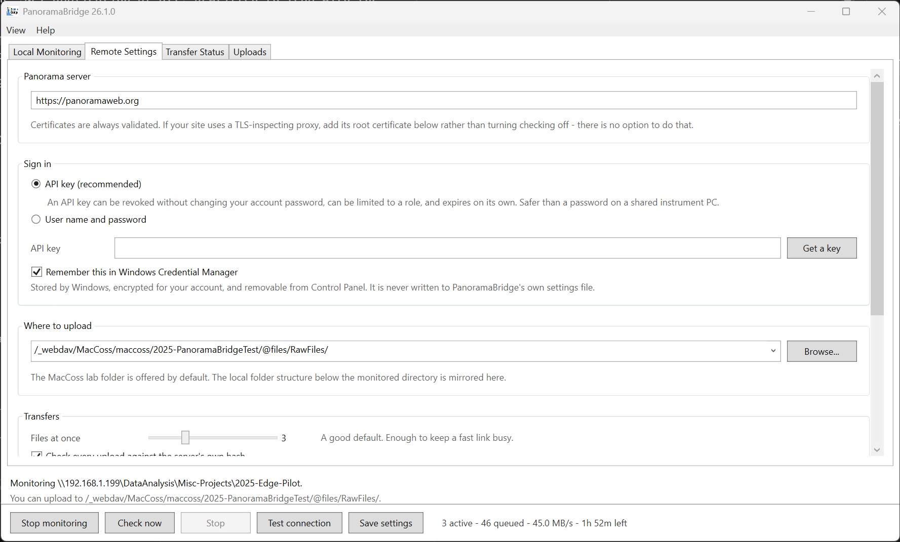
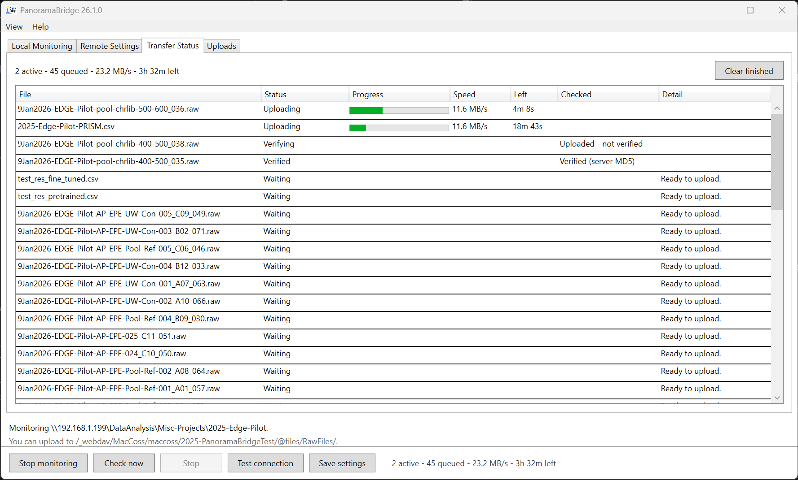
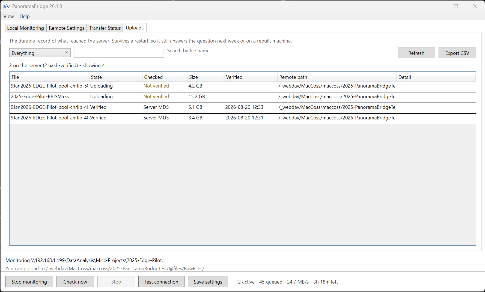

# PanoramaBridge

[](https://github.com/maccoss/PanoramaBridge/actions/workflows/ci.yml)
[](https://github.com/maccoss/PanoramaBridge/releases/latest)
[](https://dotnet.microsoft.com/download/dotnet/8.0)
[](https://github.com/maccoss/PanoramaBridge/releases/latest)
[](https://github.com/maccoss/PanoramaBridge/releases)
[](https://opensource.org/licenses/Apache-2.0)

Watches the folder your mass spectrometer writes into and transfers each acquisition to a
Panorama (LabKey) server as it finishes, confirming every upload against the checksum the server
computes over the bytes it stored.

A native Windows application built on .NET 8 and WPF. It runs on the instrument computer, so it
is written to stay out of the way: watching a folder costs about 0.026% of one processor core.

> **Upgrading from the Python version?** See [Moving from the Python application](#moving-from-the-python-application).
> The Python source is still in this repository but is no longer developed.

## Quick Links

- **[Download the installer](https://github.com/maccoss/PanoramaBridge/releases/latest)** - per-user install, no administrator rights
- **[Release notes](release-notes/)** - what changed, per version
- **[.NET port handoff](docs/DOTNET_PORT_HANDOFF.md)** - architecture, measurements, and the traps that cost real time
- **[AI development guide](CLAUDE.md)** - conventions for working on this codebase

## Installing

Download `MacCossLab.PanoramaBridge-win-Setup.exe` from the
[latest release](https://github.com/maccoss/PanoramaBridge/releases/latest) and run it. It
installs for the current user only and needs no administrator rights, so it works on a
locked-down instrument PC. Nothing else has to be installed first.

The build is not yet code-signed, so SmartScreen warns on first run: choose **More info**, then
**Run anyway**. `SHA256SUMS.txt` is published with every release if you would like to check the
download.

Installed copies update themselves: they check at startup and every four hours, download in the
background, and apply on the next restart. An upload in progress is never interrupted.

A portable `.zip` is published as well, for machines where installing is not an option.

## Getting started

1. **Remote Settings** - enter your Panorama server and an API key (User menu → External Tool
   Access on Panorama), then **Test connection**. It reports whether the destination is writable
   before you start a six-hour transfer rather than after.
2. **Local Monitoring** - choose the folder your instrument writes into and the file extensions
   to transfer.
3. **Start monitoring** - that is all. Files are transferred as they finish being written.

**Upload now** does a single pass instead, for anyone who would rather drive it by hand.

## What it does

- **Watches continuously.** The folder is walked in full every fifteen minutes, and that walk is
  what guarantees nothing is missed. Windows change notifications are used as well so a file
  usually starts within seconds, but they are treated as a bonus: they are dropped under load and
  are server-dependent over a network share.
- **Never uploads a half-written file.** A file transfers only once nothing else holds it open
  *and* its size has stopped changing. Both are required: an instrument often leaves its output
  readable while still writing, and Windows does not keep a file's recorded size up to date while
  a write handle is open.
- **Never overstates what it checked.** Every upload is confirmed against Panorama's own
  checksum. The Uploads tab distinguishes *Verified (server MD5)* from *Uploaded — size only*
  from *not verified*.
- **Leaves a record with the data.** A small `.md5` file is written beside each upload holding
  its checksum, its size and the date the instrument wrote it. The first line is what `md5sum`
  writes, so `md5sum -c run.raw.md5` works years later with no special tooling.
- **Keeps the collection date.** A file on Panorama shows the date it was acquired, not the date
  it was transferred.
- **Remembers.** The Uploads tab reads a durable record, so "did that actually get uploaded?" is
  still answerable next week or on a rebuilt machine. It filters, searches and exports to CSV.
- **Stays out of the way.** Transfers run at below-normal priority so an acquisition always wins.

`pbctl`, a command-line harness, ships alongside for scripted transfers and for measuring what
monitoring costs on a given machine.

## What it looks like

Four tabs. Settings on the first two, and what is happening on the last two.

### Local Monitoring

Where to watch and when a file counts as finished. The path shown is a UNC path because a mapped
drive was chosen and resolved to the share it stands for.



### Remote Settings

Where to upload, and how to sign in. An API key is preferred over the account password: it can be
revoked without changing the password, limited to a role, and expires on its own.



### Transfer Status

What is happening now. Rows are grouped by what they are doing rather than when they turned up:
transfers in progress at the top, then anything needing a decision, then what has finished, then
files still waiting. A file moves down the list as it progresses.



### Uploads

The durable record, read from the ledger rather than the transfer list, so it still answers next
week or on a rebuilt machine. Note the Checked column: *Server MD5* and *Not verified* are
deliberately not the same claim.



## Moving from the Python application

Install the new application alongside the old one rather than over it. They keep entirely
separate settings and history, so you can run the Python version until you are satisfied.

- Settings are **not** imported. Fill in the two settings tabs once.
- Upload history is **not** imported: the old format was a Python pickle, which cannot be read
  safely from .NET.
- Nothing is lost by that. Point the new application at the same folder and the same destination,
  and its first pass recognises everything already on the server from its checksums and records
  it as already there.
- Application data now lives in `%LOCALAPPDATA%\PanoramaBridge\` rather than
  `~/.panoramabridge/`.

## Building from source

```bash
dotnet build PanoramaBridge.sln -c Release
dotnet test  PanoramaBridge.sln -c Release      # no network required
src/PanoramaBridge.App/bin/Release/net8.0-windows/PanoramaBridge.exe
```

Requires the [.NET 8 SDK](https://dotnet.microsoft.com/download/dotnet/8.0). See
[`CLAUDE.md`](CLAUDE.md) for house style and [`docs/DOTNET_PORT_HANDOFF.md`](docs/DOTNET_PORT_HANDOFF.md)
for the architecture and the reasoning behind it.

## Support

1. **Logs** - `%LOCALAPPDATA%\PanoramaBridge\logs`, or **Help → Open log folder**. Credentials are
   scrubbed from them, so a log is safe to attach to a support request.
2. **Test connection** - reports whether the server is reachable and the destination writable.
3. **[Open an issue](https://github.com/maccoss/PanoramaBridge/issues)** - please include the
   version from the title bar and the relevant log.

### File types commonly sent to Panorama

- **Mass spectrometry**: `.raw`, `.wiff`, `.wiff2`, `.mzML`, `.mzXML`
- **Xcalibur sequences**: `.sld`
- **Proteomics**: `.fasta`, `.csv`, `.tsv`, `.txt`
- **Analysis results**: `.pdf`, `.xlsx`, `.zip`

---

# The Python application (retired)

> [!NOTE]
> Everything below describes the **retired** Python/PyQt6 application, kept for reference while
> existing installations are migrated. It is no longer developed, and the `panoramabridge` PyPI
> package is no longer the recommended way to install. It will be removed from this repository in
> a future release - see [`docs/PYTHON_REMOVAL_PLAN.md`](docs/PYTHON_REMOVAL_PLAN.md).

[](https://badge.fury.io/py/panoramabridge)
[](https://www.python.org/downloads/)

Install with `pip install panoramabridge`, then run `panoramabridge`. Requires Python 3.9 or
later and PyQt6, watchdog, requests and keyring.

Screenshots of the Python interface are in git history; `screenshots/` now holds the .NET
application. The tab descriptions below still describe the Python UI.

## Creating a Windows Executable (Optional)

> **For detailed Windows build instructions, see [BUILD_WINDOWS.md](build_scripts/BUILD_WINDOWS.md)**

To create a standalone .exe file:

### 1. Install PyInstaller

```bash
pip install pyinstaller
```

### 2. Create the Executable

```bash
pyinstaller --onefile --windowed --name "PanoramaBridge" panoramabridge.py
```

The executable will be in the `dist` folder.

### Alternative: Use Build Scripts

For easier building on Windows, use the provided build scripts:

- **Command Prompt**: Run `build_windows.bat`
- **PowerShell**: Run `build_windows.ps1`

These scripts automatically handle virtual environment setup, dependency installation, and executable creation. See [BUILD_WINDOWS.md](build_scripts/BUILD_WINDOWS.md) for complete details.

## User Interface

### Local Monitoring Tab

- **Directory Selection**: Choose the local folder to monitor for new files
- **File Extensions**: Specify which file types to monitor (e.g., `raw, sld, csv, txt`)
- **Subdirectory Monitoring**: Option to include all subfolders
- **Directory Structure**: Preserve local folder structure on remote server
- **File Stability**: Configure how long to wait before considering a file complete

### Advanced Settings Tab

- **File Monitoring Optimization**:
  - **OS Events vs Polling**: Uses efficient OS-level file system events by default
  - **Backup Polling**: Optional backup polling for unreliable file systems (disabled by default)
  - **Polling Interval**: Configurable 1-30 minute intervals when backup polling is enabled

- **Locked File Handling** (Mass Spectrometer Workflows):
  - **Smart Detection**: Automatically detects when files are locked by instruments during data acquisition
  - **Intelligent Retry**: Configurable wait times and retry intervals for locked files
  - **Progress Indication**: Shows elapsed wait time with countdown timers
  - **Initial Wait Time**: Default 30 minutes before first retry (configurable)
  - **Retry Interval**: Default 30 seconds between retry attempts (configurable)
  - **Max Retries**: Default 20 attempts before giving up (configurable)

- **Performance Settings**:
  - **Checksum Caching**: Local caching for dramatic performance improvements (up to 1700x faster)
  - **Cache Management**: Automatic cleanup and memory management
  - **Upload Verification**: Configurable post-upload integrity checking

### Remote Settings Tab

- **WebDAV Connection**: Configure Panorama server connection
  - URL: Your Panorama server (e.g., `https://panoramaweb.org`)
  - Authentication: Username and password with secure storage option
  - Connection testing with automatic endpoint detection
- **Remote Path Selection**: Browse and select destination folders
- **Transfer Settings**: Configure upload verification for integrity checking
- **Upload Verification**: Enable/disable post-upload integrity checking

### Transfer Status Tab

- **Queue Monitor**: See how many files are waiting for transfer
- **Progress Tracking**: Real-time progress bars for active uploads
- **Activity Log**: Timestamped events and error messages
- **Log Access**: View → View Application Logs for detailed troubleshooting

## How PanoramaBridge Works: Step-by-Step Process

PanoramaBridge follows a systematic approach to monitor, verify, and transfer files to remote WebDAV servers. Here's the detailed process:

### 1. File Discovery and Monitoring

**Directory Scanning Methods:**
- **Primary Method**: OS-level file system events using the `watchdog` library
  - Monitors `on_created`, `on_modified`, and `on_moved` events
  - **Immediate detection** with no polling overhead
  - Handles file extensions: `.raw`, `.wiff`, `.mzML`, `.mzXML`, etc.
- **Backup Method**: Optional polling (disabled by default)
  - Configurable 1-30 minute intervals
  - Uses `os.walk()` for recursive scanning or `os.listdir()` for single directory
  - Only enabled when file system events are unreliable (network mounts, WSL2)

**Extension Filtering:**
- Case-insensitive matching against user-configured extensions
- Filters out hidden files (starting with `.` or `~`)
- Supports both recursive and non-recursive directory monitoring

### 2. File Stability Verification

**Stability Detection:**
- Tracks file size changes over time using a pending files dictionary
- Default 1-second stability timeout (file size unchanged)
- Prevents uploading files still being written by instruments
- Smart locked file handling for mass spectrometer workflows

**Duplicate Prevention:**
- Maintains sets of `queued_files` and `processing_files` to prevent duplicates
- Checks against remote paths to avoid re-uploading same destinations

### 3. Remote File Existence Check

**WebDAV PROPFIND Method:**
```http
PROPFIND /remote/path/filename.raw HTTP/1.1
Host: panoramaweb.org
Depth: 0
```

**Verification Process:**
- Sends HTTP PROPFIND request to check if file already exists on remote server
- Retrieves remote file metadata: size, modification time, ETag
- If file exists, compares with local file for conflict resolution
- Creates necessary remote directories using WebDAV `MKCOL` method

### 4. Checksum Calculation

**SHA256 Algorithm with Caching:**
- **Method**: SHA256 hash calculation using Python's `hashlib` library
- **Chunk Size**: 256KB chunks for optimal memory/performance balance
- **Caching System**: Local cache using file path + size + modification time as key
  - Cache limit: 1,000 entries with automatic cleanup
  - Cache invalidation on file size or modification time changes

**Implementation:**
```python
hash_obj = hashlib.sha256()
with open(filepath, 'rb') as f:
    while chunk := f.read(256 * 1024):  # 256KB chunks
        hash_obj.update(chunk)
checksum = hash_obj.hexdigest()
```

### 5. File Upload Process

**Adaptive Chunked Upload:**
- **Chunk Size Determination** (based on file size):
  - Files < 100MB: 64KB chunks
  - 100MB - 1GB: 256KB chunks
  - 1GB - 5GB: 1MB chunks
  - 5GB - 10GB: 2MB chunks
  - Files > 10GB: 4MB chunks

**Upload Methods:**
- **Large Files (>100MB)**: Attempts Range request chunking
  - Multiple HTTP PUT requests with `Content-Range` headers
  - True progress tracking with real-time callbacks
- **Standard Files**: Single HTTP PUT request with streaming
- **Progress Tracking**: Real-time progress callbacks with bytes uploaded

**HTTP Implementation:**
```http
PUT /webdav/remote/path/filename.raw HTTP/1.1
Host: panoramaweb.org
Content-Range: bytes 0-1048575/104857600
Content-Length: 1048576
Authorization: Basic <credentials>

[file chunk data]
```

### 6. Upload Verification System

**Simple 3-Step Verification Process:**

**Step 1: File Existence & Size Check**
- Confirms remote file exists at expected path
- Compares local and remote file sizes
- Returns early if sizes don't match

**Step 2: ETag Verification (Primary Method)**
- Attempts SHA256 ETag comparison first (most servers)
- Falls back to MD5 ETag comparison (Apache default)
- ETag mismatch indicates file difference and triggers conflict resolution

**Step 3: Accessibility Check (Fallback)**  
- Used only when ETag is unavailable or unknown format
- Downloads first 8KB to verify file can be read
- Confirms file exists, is readable, and user has permissions
- **Note**: This is limited verification - cannot confirm complete file integrity

**Implementation:**
```python
def verify_remote_file_integrity(self, local_filepath: str, remote_path: str, expected_checksum: str) -> tuple[bool, str]:
    """Verify remote file exists and matches expected local file using 3-step verification"""
    
    # Step 1: File existence and size comparison
    if local_size != remote_size:
        return False, f"size mismatch (local: {local_size}, remote: {remote_size})"
    
    # Step 2: ETag verification (primary method)
    if remote_etag and expected_checksum:
        clean_etag = remote_etag.strip('"').replace("W/", "")
        
        # Try SHA256 match first
        if clean_etag.lower() == expected_checksum.lower():
            return True, "ETag (SHA256 format)"
        
        # Try MD5 match for Apache servers
        elif len(clean_etag) == 32:
            local_md5 = hashlib.md5(open(local_filepath, 'rb').read()).hexdigest()
            if clean_etag.lower() == local_md5.lower():
                return True, "ETag (MD5 format)"
            else:
                return False, "ETag mismatch - file difference detected"
        
        # ETag mismatch with same length = file difference requiring resolution
        elif len(clean_etag) == len(expected_checksum):
            return False, "ETag mismatch - file difference detected"
    
    # Step 3: Accessibility check (fallback when ETag unavailable/unknown)
    head_data = self.webdav_client.download_file_head(remote_path, 8192)
    if head_data is None:
        return False, "cannot read remote file"
    
    if remote_etag is None:
        return True, "Size + accessibility (ETag unavailable)"
    else:
        return True, "Size + accessibility (unknown ETag format)"
```

### 7. Upload History and Remote Integrity Verification

**Persistent Upload Tracking:**
- Maintains a JSON file (`~/.panorama_upload_history.json`) tracking all successful uploads
- Records file path, size, checksum, and timestamp for each uploaded file
- Enables intelligent skip-already-uploaded file detection across application restarts

**On-Demand Remote Integrity Verification:**
PanoramaBridge uses a comprehensive 3-step verification system for remote integrity checks:

1. **Startup Verification**: Automatically checks all local files when monitoring starts to ensure they exist on remote server
2. **Manual Verification**: "Remote Integrity Check" button for on-demand verification of all files in the transfer table
3. **Intelligent Conflict Resolution**: Handles file differences through configurable conflict resolution settings
4. **Automatic Recovery**: Missing files are automatically queued for re-upload

**Verification Results:**
- **Verified**: File exists and integrity confirmed
- **Missing**: File not found on remote - automatically queued for re-upload
- **Changed/Conflict**: File differs between local and remote - uses conflict resolution settings to determine action
- **Errors**: Network/verification errors - logged for troubleshooting

**Conflict Resolution Approach:**
When files differ between local and remote, PanoramaBridge no longer assumes corruption. Instead, it treats all differences as potential conflicts and applies your configured conflict resolution settings:

- **"Ask me each time"**: Shows dialog for user to choose action (Upload, Skip, etc.)
- **"Always upload"**: Automatically uploads the local version
- **"Always skip"**: Keeps the remote version unchanged
- **Other settings**: Applied according to your configuration

This approach ensures that legitimate changes (whether local or server-side) are handled appropriately without assuming data corruption.

### 8. Metadata Storage and Integrity

**Checksum Storage:**
- Stores checksums on WebDAV server as metadata files
- File naming: `filename.raw.checksum` containing SHA256 hash
- Used for future conflict resolution and integrity verification

**Conflict Resolution:**
- Compares local checksum with stored remote checksum
- User notification for checksum mismatches
- Options to overwrite, skip, or manual resolution

### 8. Error Handling and Retry Logic

**Locked File Handling:**
- **Detection**: Identifies files locked by mass spectrometers during acquisition
- **Smart Retry**: Configurable wait times and retry intervals
  - Default: 30-minute initial wait, 30-second retry interval, 20 max attempts
- **Progress Indication**: Shows elapsed time and countdown timers
- **Status Messages**: "File locked - waiting for instrument (5/30 minutes elapsed)"

**Network Resilience:**
- Automatic retry for network failures
- Persistent HTTP sessions for connection reuse
- Timeout handling and connection management
- Comprehensive error logging with detailed diagnostic information

This systematic approach ensures reliable, efficient, and verified file transfer while providing comprehensive monitoring and error handling for laboratory mass spectrometry workflows.

## Application Features

### File Monitoring

- **Real-time Detection**: Monitors for new files as they're created
- **File Stability Check**: Waits until files are fully written before transfer
- **Extension Filtering**: Only processes files with specified extensions
- **Subdirectory Support**: Optional recursive monitoring

### WebDAV Transfer

- **Chunked Upload**: Handles large files efficiently with configurable chunk sizes
- **Progress Tracking**: Real-time progress bars for each transfer
- **Checksum Generation**: Calculates SHA256 checksums for upload metadata (not used for verification due to performance cost)
- **Multi-Format ETag Verification**: Supports SHA256 and MD5 ETags for efficient integrity checking
- **Accessibility Verification**: Downloads first 8KB to verify file readability when ETags unavailable
- **Directory Structure**: Option to preserve local folder structure on remote
- **Automatic Retry**: Robust error handling and connection management

### Security & Credentials

- **Secure Credential Storage**: Uses system keyring for safe password storage
- **Support for Basic and Digest authentication**
- **No plaintext password storage**
- **Cross-platform keyring support with fallback options**

### Remote Directory Management

- **Remote Browser**: Navigate WebDAV directories with GUI
- **Folder Creation**: Create new folders on the remote server
- **Visual Directory Tree**: Easy navigation and selection
- **Path Selection**: Select destination paths intuitively

## Menu System

- **View Menu**:
  - **View Application Logs**: Access detailed logs for troubleshooting
- **Help Menu**:
  - **About**: Application information and log file location

## Configuration

Settings are automatically saved in:

- **Windows**: `%USERPROFILE%\.panoramabridge\config.json`
- **Linux/Mac**: `~/.panoramabridge/config.json`

Credentials are stored securely in the system keyring.

Application logs are saved to: `panoramabridge.log`

## Troubleshooting

### Common Issues

#### Connection Problems

1. **"Connection Failed" Error**
   - Verify Panorama server URL (usually `https://panoramaweb.org`)
   - The application automatically tries `/webdav` endpoint if needed
   - Check username and password
   - Try both Basic and Digest authentication types
   - Ensure server is accessible from your network

2. **Keyring/Credential Storage Issues**
   - If you see "keyring backend not available" errors:
     - The application automatically installs `keyrings.alt` package
     - Restart the application after installation
     - Credentials will be saved securely on subsequent attempts

#### File Monitoring Issues

3. **Files Not Being Detected**
   - Verify directory path is correct and accessible
   - Check file extensions match exactly (case-insensitive)
   - Ensure files are being created in the monitored directory
   - Check subdirectory monitoring setting if files are in subfolders
   - File stability timeout may need adjustment for large files
   - **WSL2 Users**: For better file system event detection on Windows, use the native Windows build with `.venv-win`

4. **Locked File Handling (Mass Spectrometer Workflows)**
   - **"File locked - waiting for instrument"**: This is normal behavior when instruments are writing data
   - **Progress indication**: Status shows elapsed wait time like "File locked - waiting for instrument (5/30 minutes elapsed)"
   - **Configuration**: Adjust wait times in Advanced Settings → Locked File Handling
   - **Immediate retry**: If you know a file is ready, restart monitoring to retry immediately
   - **Max retries exceeded**: Increase max retries or check if instrument finished writing
   - **Troubleshooting**: Check logs for "File locked during checksum" messages

#### Upload Problems

5. **Upload Verification Issues**
   - **"Verification failed" after successful upload**:
     - Check network stability during verification
     - Verification uses ETag comparison when available, size + accessibility check as fallback
     - Disable verification in Transfer Settings if experiencing frequent issues
     - Manual verification: Use "Remote Integrity Check" button for on-demand verification
   - **Slow upload verification**:
     - ETag verification is very fast (no download required)
     - Accessibility check downloads only 8KB for file readability test
     - Disable verification for maximum upload speed (less secure)

6. **File Conflict Resolution**
   - **"File conflict detected" messages**: This is normal when files differ between local and remote
   - **Not corruption**: The system no longer assumes files are corrupted when they differ
   - **Conflict handling**: Uses your configured conflict resolution setting ("Ask me each time", "Always upload", etc.)
   - **User choice respected**: When set to "Ask me each time", you'll see a dialog to choose the action
   - **Clear guidance**: Messages explain what differences were detected and what actions will be taken

5. **Folder Creation Failures (HTTP 403)**
   - **Permission Denied**: Most common issue
   - Contact your Panorama administrator to request write permissions
   - Try creating folders in directories where you have write access
   - Check if you're in the correct user directory path

5. **Path Encoding Issues (HTTP 409 - Path Conflict)**
   - **Special Characters in Directory Names**: Fixed in current version
   - Previously, directories with `@` symbols (like `@files`) could cause encoding issues
   - The application now properly handles URL encoding/decoding for special characters
   - If you encounter path conflicts, try refreshing the directory listing

6. **Upload Failures**
   - Check available space on Panorama server
   - Verify write permissions for the selected remote path
   - Try reducing chunk size for problematic connections
   - Check network connectivity and stability
   - Monitor the application logs via View → View Application Logs

#### Performance Issues

7. **Large File Problems**
   - Chunk sizes are automatically optimized based on file size
   - Ensure stable network connection
   - Check server timeout settings
   - Monitor system memory usage during transfers

### Panorama-Specific Notes

#### Server Configuration

- **Panorama WebDAV Endpoint**: Typically `/webdav` (auto-detected)
- **Authentication**: Usually Basic authentication
- **File Types**: Commonly used for `.raw`, `.mzML`, `.mzXML`, `.wiff` files
- **Directory Structure**: Often organized by project/experiment

#### Permissions

- Write access must be granted by Panorama administrators
- Users typically have access to their own directories
- Project-specific permissions may apply
- Contact your Panorama administrator for access issues

### Logging and Diagnostics

#### Accessing Logs

1. **In-Application**: View → View Application Logs
2. **Log File**: `panoramabridge.log` in the application directory
3. **Activity Tab**: Real-time events in the Transfer Status tab

#### What to Include in Support Requests

1. Complete error messages from the application logs
2. Panorama server URL and username (no passwords)
3. File types and sizes being transferred
4. Network configuration details
5. Steps to reproduce the issue

### Performance Optimization

#### For Large Files (>1GB)

- Chunk sizes are automatically optimized (up to 4MB for files >10GB)
- Use wired network connection
- Transfer during off-peak hours
- Monitor system resources

#### For Many Small Files

- Automatic 64KB chunks optimize small file transfers
- Monitor queue size in Transfer Status tab
- Consider organizing files into batches

#### Network Optimization

- Use stable, high-bandwidth connection
- Check for network restrictions or firewalls
- Monitor server load and availability
- Consider VPN if accessing from outside institution

## Additional Documentation

### Technical Documentation
- **[Checksum Caching Implementation](docs/CHECKSUM_CACHING_SUMMARY.md)** - Details about the local checksum caching system that provides dramatic performance improvements
- **[File Monitoring Optimization](docs/FILE_MONITORING_OPTIMIZATION.md)** - Technical details about the optimized file monitoring system and performance benchmarks
- **[File Monitoring Robustness](docs/FILE_MONITORING_ROBUSTNESS_IMPROVEMENTS.md)** - Thread safety and robustness improvements for file monitoring
- **[Queue and Cache Implementation](docs/QUEUE_CACHE_IMPLEMENTATION_SUMMARY.md)** - Transfer queue management and persistent caching features

### Development and Testing
- **[Test Suite Documentation](docs/TEST_SUITE_SUMMARY.md)** - Comprehensive test coverage and testing methodology
- **[Test Setup Guide](docs/TEST_SETUP.md)** - Instructions for setting up and running tests

### Build and Deployment
- **[Windows Build Instructions](build_scripts/BUILD_WINDOWS.md)** - Complete guide for building Windows executables
- **[GitHub Actions CI/CD](build_scripts/GITHUB_ACTIONS.md)** - Automated builds and releases
- **[Build Scripts Overview](build_scripts/README.md)** - Build automation and deployment tools

### Demo Scripts and Examples
- **[Demo Scripts Overview](demo_scripts/README.md)** - Example scripts and diagnostic tools for development and testing

## Support and Resources

### Getting Help

1. **Application Logs**: First check View → View Application Logs for detailed error information
2. **Test Connection**: Verify settings with the "Test Connection" button
3. **Panorama Documentation**: Refer to your institution's Panorama setup guide
4. **Administrator Contact**: Reach out to your Panorama administrator for permissions

### Common File Types for Panorama

- **Mass Spectrometry**: `.raw`, `.wiff`, `.mzML`, `.mzXML`
- **Xcalibur Sequences**: `.sld` (Sequence documents)
- **Proteomics**: `.fasta`, `.csv`, `.tsv`, `.txt`
- **Analysis Results**: `.pdf`, `.xlsx`, `.zip`


