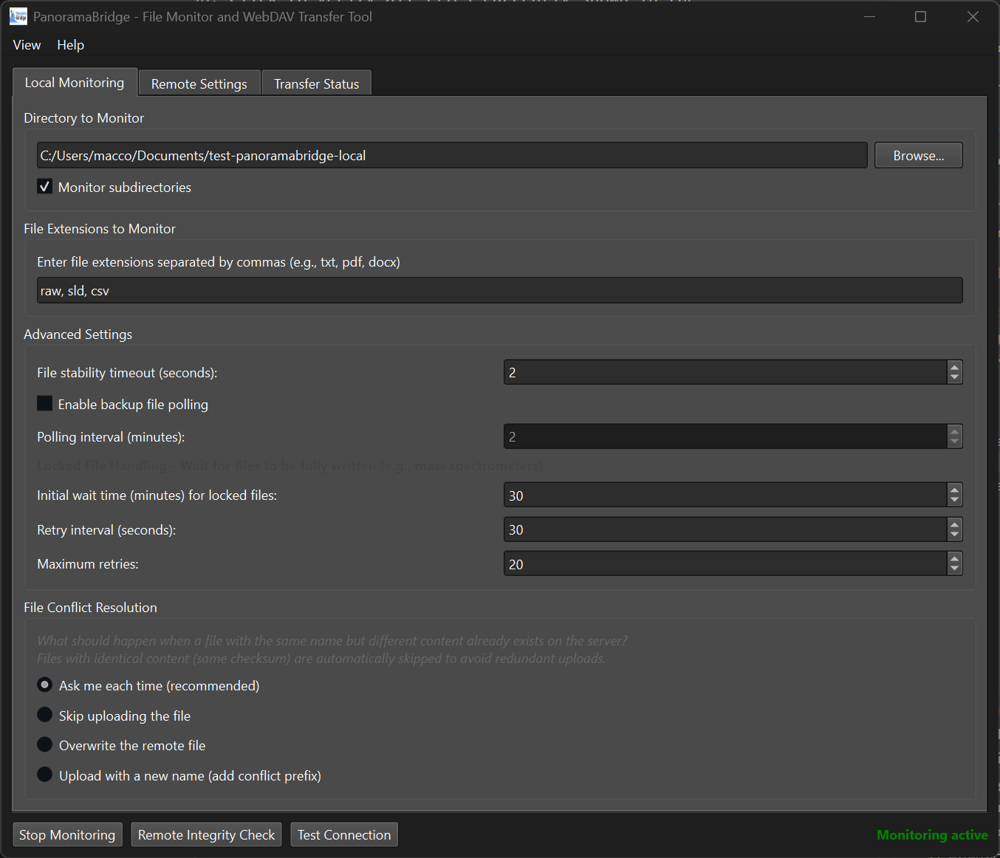

# PanoramaBridge

A Python Qt6 application for monitoring local directories and automatically transferring files to Panorama WebDAV servers. This tool provides intelligent file monitoring with secure credential storage, robust upload capabilities, and advanced features specifically designed for mass spectrometer workflows.

## Quick Links
- **[Installation](#installation-steps)** - Get started with setup
- **[User Guide](#user-interface)** - How to use the application
- **[Windows Build](build_scripts/BUILD_WINDOWS.md)** - Create executable
- **[GitHub Actions](build_scripts/GITHUB_ACTIONS.md)** - Automated builds and releases
- **[Technical Docs](#additional-documentation)** - Performance and optimization details

## Features

### Core Features
- **Intelligent File Monitoring**: OS-level file system events with optional backup polling
- **WebDAV Integration**: Seamless integration with Panorama WebDAV servers
- **Secure Credential Storage**: Uses system keyring for safe password storage
- **Chunked Upload**: Efficient handling of large files with progress tracking
- **Directory Structure Preservation**: Maintains folder hierarchy on remote server
- **Remote Directory Browser**: Navigate and create folders on the WebDAV server

### Advanced Features
- **Smart Locked File Handling**: Automatically detects and retries locked files from mass spectrometers
- **Checksum Caching**: Dramatic performance improvements (up to 1700x faster for unchanged files)
- **Progress Indication**: Real-time progress bars with elapsed time and countdown timers
- **Windows Native Support**: Optimized .venv-win virtual environment for better file system event detection
- **Configurable Retry Logic**: Customizable wait times and retry attempts for locked files

### Performance & Reliability
- **OS Event-Driven Monitoring**: Immediate file detection without polling overhead
- **Intelligent Conflict Resolution**: Smart file comparison and duplicate handling
- **Comprehensive Logging**: Detailed logs with menu-based access for troubleshooting
- **Cross-platform**: Works on Windows, Linux, and macOS (Windows native recommended)

## Requirements

### Python Dependencies

The `requirements.txt` file includes all necessary dependencies:

```
PyQt6>=6.4.0
watchdog>=3.0.0
requests>=2.31.0
keyring>=24.0.0
keyrings.alt>=5.0.0
```

## Installation Steps

### 1. Install Python

- Download Python 3.9 or later from [python.org](https://www.python.org/)
- During installation, check "Add Python to PATH"

### 2. Create Virtual Environment (Recommended)

#### For Windows (Native Performance):
```bash
# Create Windows-optimized virtual environment
python -m venv .venv-win

# Activate it
.venv-win\Scripts\activate
```

#### For General Use:
```bash
# Create virtual environment
python -m venv .venv

# Activate it
# On Windows:
.venv\Scripts\activate
# On Linux/Mac:
source .venv/bin/activate
```

### 3. Install Dependencies

```bash
pip install -r requirements.txt
```

### 4. Run the Application

```bash
python panoramabridge.py
```

## Quick Start

1. **Launch the application**: `python panoramabridge.py`
2. **Configure WebDAV connection**:
   - Go to "Remote Settings" tab
   - Enter your Panorama server URL (e.g., `https://panoramaweb.org`)
   - Add your username and password
   - Click "Test Connection" to verify
3. **Set up monitoring**:
   - Go to "Local Monitoring" tab
   - Select directory to monitor
   - Specify file extensions (e.g., `raw, sld, csv`)
   - Choose remote destination folder
4. **Start monitoring**: Click "Start Monitoring"
5. **View progress**: Check "Transfer Status" tab for real-time updates

## Creating a Windows Executable (Optional)

> **📋 For detailed Windows build instructions, see [BUILD_WINDOWS.md](build_scripts/BUILD_WINDOWS.md)**

To create a standalone .exe file:

### 1. Install PyInstaller

```bash
pip install pyinstaller
```

### 2. Create the Executable

```bash
pyinstaller --onefile --windowed --name "PanoramaBridge" panoramabridge.py
```

The executable will be in the `dist` folder.

### Alternative: Use Build Scripts

For easier building on Windows, use the provided build scripts:

- **Command Prompt**: Run `build_windows.bat`
- **PowerShell**: Run `build_windows.ps1`

These scripts automatically handle virtual environment setup, dependency installation, and executable creation. See [BUILD_WINDOWS.md](build_scripts/BUILD_WINDOWS.md) for complete details.

## User Interface

### Local Monitoring Tab

- **Directory Selection**: Choose the local folder to monitor for new files
- **File Extensions**: Specify which file types to monitor (e.g., `raw, sld, csv, txt`)
- **Subdirectory Monitoring**: Option to include all subfolders
- **Directory Structure**: Preserve local folder structure on remote server
- **File Stability**: Configure how long to wait before considering a file complete



### Advanced Settings Tab

- **File Monitoring Optimization**:
  - **OS Events vs Polling**: Uses efficient OS-level file system events by default
  - **Backup Polling**: Optional backup polling for unreliable file systems (disabled by default)
  - **Polling Interval**: Configurable 1-30 minute intervals when backup polling is enabled

- **Locked File Handling** (Mass Spectrometer Workflows):
  - **Smart Detection**: Automatically detects when files are locked by instruments during data acquisition
  - **Intelligent Retry**: Configurable wait times and retry intervals for locked files
  - **Progress Indication**: Shows elapsed wait time with countdown timers
  - **Initial Wait Time**: Default 30 minutes before first retry (configurable)
  - **Retry Interval**: Default 30 seconds between retry attempts (configurable)
  - **Max Retries**: Default 20 attempts before giving up (configurable)

- **Performance Settings**:
  - **Checksum Caching**: Local caching for dramatic performance improvements (up to 1700x faster)
  - **Cache Management**: Automatic cleanup and memory management
  - **Upload Verification**: Configurable post-upload integrity checking

### Remote Settings Tab

- **WebDAV Connection**: Configure Panorama server connection
  - URL: Your Panorama server (e.g., `https://panoramaweb.org`)
  - Authentication: Username and password with secure storage option
  - Connection testing with automatic endpoint detection
- **Remote Path Selection**: Browse and select destination folders
- **Transfer Settings**: Configure upload verification for integrity checking
- **Upload Verification**: Enable/disable post-upload integrity checking


### Transfer Status Tab

- **Queue Monitor**: See how many files are waiting for transfer
- **Progress Tracking**: Real-time progress bars for active uploads
- **Activity Log**: Timestamped events and error messages
- **Log Access**: View → View Application Logs for detailed troubleshooting


## How PanoramaBridge Works: Step-by-Step Process

PanoramaBridge follows a systematic approach to monitor, verify, and transfer files to remote WebDAV servers. Here's the detailed process:

### 1. File Discovery and Monitoring

**Directory Scanning Methods:**
- **Primary Method**: OS-level file system events using the `watchdog` library
  - Monitors `on_created`, `on_modified`, and `on_moved` events
  - **Immediate detection** with no polling overhead
  - Handles file extensions: `.raw`, `.wiff`, `.mzML`, `.mzXML`, etc.
- **Backup Method**: Optional polling (disabled by default)
  - Configurable 1-30 minute intervals
  - Uses `os.walk()` for recursive scanning or `os.listdir()` for single directory
  - Only enabled when file system events are unreliable (network mounts, WSL2)

**Extension Filtering:**
- Case-insensitive matching against user-configured extensions
- Filters out hidden files (starting with `.` or `~`)
- Supports both recursive and non-recursive directory monitoring

### 2. File Stability Verification

**Stability Detection:**
- Tracks file size changes over time using a pending files dictionary
- Default 1-second stability timeout (file size unchanged)
- Prevents uploading files still being written by instruments
- Smart locked file handling for mass spectrometer workflows

**Duplicate Prevention:**
- Maintains sets of `queued_files` and `processing_files` to prevent duplicates
- Checks against remote paths to avoid re-uploading same destinations

### 3. Remote File Existence Check

**WebDAV PROPFIND Method:**
```http
PROPFIND /remote/path/filename.raw HTTP/1.1
Host: panoramaweb.org
Depth: 0
```

**Verification Process:**
- Sends HTTP PROPFIND request to check if file already exists on remote server
- Retrieves remote file metadata: size, modification time, ETag
- If file exists, compares with local file for conflict resolution
- Creates necessary remote directories using WebDAV `MKCOL` method

### 4. Checksum Calculation

**SHA256 Algorithm with Caching:**
- **Method**: SHA256 hash calculation using Python's `hashlib` library
- **Chunk Size**: 256KB chunks for optimal memory/performance balance
- **Caching System**: Local cache using file path + size + modification time as key
  - Up to 1,700x performance improvement for unchanged files
  - Cache limit: 1,000 entries with automatic cleanup
  - Cache invalidation on file size or modification time changes

**Implementation:**
```python
hash_obj = hashlib.sha256()
with open(filepath, 'rb') as f:
    while chunk := f.read(256 * 1024):  # 256KB chunks
        hash_obj.update(chunk)
checksum = hash_obj.hexdigest()
```

### 5. File Upload Process

**Adaptive Chunked Upload:**
- **Chunk Size Determination** (based on file size):
  - Files < 100MB: 64KB chunks
  - 100MB - 1GB: 256KB chunks
  - 1GB - 5GB: 1MB chunks
  - 5GB - 10GB: 2MB chunks
  - Files > 10GB: 4MB chunks

**Upload Methods:**
- **Large Files (>100MB)**: Attempts Range request chunking
  - Multiple HTTP PUT requests with `Content-Range` headers
  - True progress tracking with real-time callbacks
- **Standard Files**: Single HTTP PUT request with streaming
- **Progress Tracking**: Real-time progress callbacks with bytes uploaded

**HTTP Implementation:**
```http
PUT /webdav/remote/path/filename.raw HTTP/1.1
Host: panoramaweb.org
Content-Range: bytes 0-1048575/104857600
Content-Length: 1048576
Authorization: Basic <credentials>

[file chunk data]
```

### 6. Upload Verification

**Two-Tier Verification System:**

**For Files < 50MB:**
- Downloads complete remote file to temporary location
- Calculates SHA256 checksum of downloaded file
- Compares local and remote checksums for exact match
- Automatic cleanup of temporary files

**For Files ≥ 50MB:**
- **ETag Comparison**: Compares server ETag with local checksum
- **Size Verification**: Confirms remote file size matches local
- **Storage Optimization**: Avoids downloading large files for verification

**Verification Methods:**
```python
# Small file verification
remote_checksum = calculate_checksum(downloaded_temp_file)
verified = (remote_checksum.lower() == local_checksum.lower())

# Large file verification
verified = (clean_etag.lower() == local_checksum.lower()) or size_matches
```

### 7. Metadata Storage and Integrity

**Checksum Storage:**
- Stores checksums on WebDAV server as metadata files
- File naming: `filename.raw.checksum` containing SHA256 hash
- Used for future conflict resolution and integrity verification

**Conflict Resolution:**
- Compares local checksum with stored remote checksum
- User notification for checksum mismatches
- Options to overwrite, skip, or manual resolution

### 8. Error Handling and Retry Logic

**Locked File Handling:**
- **Detection**: Identifies files locked by mass spectrometers during acquisition
- **Smart Retry**: Configurable wait times and retry intervals
  - Default: 30-minute initial wait, 30-second retry interval, 20 max attempts
- **Progress Indication**: Shows elapsed time and countdown timers
- **Status Messages**: "File locked - waiting for instrument (5/30 minutes elapsed)"

**Network Resilience:**
- Automatic retry for network failures
- Persistent HTTP sessions for connection reuse
- Timeout handling and connection management
- Comprehensive error logging with detailed diagnostic information

This systematic approach ensures reliable, efficient, and verified file transfer while providing comprehensive monitoring and error handling for laboratory mass spectrometry workflows.

## Application Features

### File Monitoring

- **Real-time Detection**: Monitors for new files as they're created
- **File Stability Check**: Waits until files are fully written before transfer
- **Extension Filtering**: Only processes files with specified extensions
- **Subdirectory Support**: Optional recursive monitoring

### WebDAV Transfer

- **Chunked Upload**: Handles large files efficiently with configurable chunk sizes
- **Progress Tracking**: Real-time progress bars for each transfer
- **Checksum Verification**: Calculates SHA256 checksums for integrity with post-upload verification
- **Upload Integrity Check**: Downloads and verifies files < 50MB, uses ETag/size comparison for larger files
- **Directory Structure**: Option to preserve local folder structure on remote
- **Automatic Retry**: Robust error handling and connection management

### Security & Credentials

- **Secure Credential Storage**: Uses system keyring for safe password storage
- **Support for Basic and Digest authentication**
- **No plaintext password storage**
- **Cross-platform keyring support with fallback options**

### Remote Directory Management

- **Remote Browser**: Navigate WebDAV directories with GUI
- **Folder Creation**: Create new folders on the remote server
- **Visual Directory Tree**: Easy navigation and selection
- **Path Selection**: Select destination paths intuitively

## Menu System

- **View Menu**:
  - **View Application Logs**: Access detailed logs for troubleshooting
- **Help Menu**:
  - **About**: Application information and log file location

## Configuration

Settings are automatically saved in:

- **Windows**: `%USERPROFILE%\.panoramabridge\config.json`
- **Linux/Mac**: `~/.panoramabridge/config.json`

Credentials are stored securely in the system keyring.

Application logs are saved to: `panoramabridge.log`

## Troubleshooting

### Common Issues

#### Connection Problems

1. **"Connection Failed" Error**
   - Verify Panorama server URL (usually `https://panoramaweb.org`)
   - The application automatically tries `/webdav` endpoint if needed
   - Check username and password
   - Try both Basic and Digest authentication types
   - Ensure server is accessible from your network

2. **Keyring/Credential Storage Issues**
   - If you see "keyring backend not available" errors:
     - The application automatically installs `keyrings.alt` package
     - Restart the application after installation
     - Credentials will be saved securely on subsequent attempts

#### File Monitoring Issues

3. **Files Not Being Detected**
   - Verify directory path is correct and accessible
   - Check file extensions match exactly (case-insensitive)
   - Ensure files are being created in the monitored directory
   - Check subdirectory monitoring setting if files are in subfolders
   - File stability timeout may need adjustment for large files
   - **WSL2 Users**: For better file system event detection on Windows, use the native Windows build with `.venv-win`

4. **Locked File Handling (Mass Spectrometer Workflows)**
   - **"File locked - waiting for instrument"**: This is normal behavior when instruments are writing data
   - **Progress indication**: Status shows elapsed wait time like "File locked - waiting for instrument (5/30 minutes elapsed)"
   - **Configuration**: Adjust wait times in Advanced Settings → Locked File Handling
   - **Immediate retry**: If you know a file is ready, restart monitoring to retry immediately
   - **Max retries exceeded**: Increase max retries or check if instrument finished writing
   - **Troubleshooting**: Check logs for "File locked during checksum" messages

#### Upload Problems

5. **Upload Verification Issues**
   - **"Verification failed" after successful upload**:
     - Check network stability during verification download
     - For files > 50MB, verification uses size/ETag comparison only
     - Disable verification in Transfer Settings if experiencing frequent issues
     - Manual verification: Compare file sizes and download checksums separately
   - **Slow upload verification**:
     - Verification downloads small files (< 50MB) to verify checksums
     - Large files use faster ETag/size comparison
     - Disable verification for maximum upload speed (less secure)

5. **Folder Creation Failures (HTTP 403)**
   - **Permission Denied**: Most common issue
   - Contact your Panorama administrator to request write permissions
   - Try creating folders in directories where you have write access
   - Check if you're in the correct user directory path

5. **Path Encoding Issues (HTTP 409 - Path Conflict)**
   - **Special Characters in Directory Names**: Fixed in current version
   - Previously, directories with `@` symbols (like `@files`) could cause encoding issues
   - The application now properly handles URL encoding/decoding for special characters
   - If you encounter path conflicts, try refreshing the directory listing

6. **Upload Failures**
   - Check available space on Panorama server
   - Verify write permissions for the selected remote path
   - Try reducing chunk size for problematic connections
   - Check network connectivity and stability
   - Monitor the application logs via View → View Application Logs

#### Performance Issues

7. **Large File Problems**
   - Chunk sizes are automatically optimized based on file size
   - Ensure stable network connection
   - Check server timeout settings
   - Monitor system memory usage during transfers

### Panorama-Specific Notes

#### Server Configuration

- **Panorama WebDAV Endpoint**: Typically `/webdav` (auto-detected)
- **Authentication**: Usually Basic authentication
- **File Types**: Commonly used for `.raw`, `.mzML`, `.mzXML`, `.wiff` files
- **Directory Structure**: Often organized by project/experiment

#### Permissions

- Write access must be granted by Panorama administrators
- Users typically have access to their own directories
- Project-specific permissions may apply
- Contact your Panorama administrator for access issues

### Logging and Diagnostics

#### Accessing Logs

1. **In-Application**: View → View Application Logs
2. **Log File**: `panoramabridge.log` in the application directory
3. **Activity Tab**: Real-time events in the Transfer Status tab

#### What to Include in Support Requests

1. Complete error messages from the application logs
2. Panorama server URL and username (no passwords)
3. File types and sizes being transferred
4. Network configuration details
5. Steps to reproduce the issue

### Performance Optimization

#### For Large Files (>1GB)

- Chunk sizes are automatically optimized (up to 4MB for files >10GB)
- Use wired network connection
- Transfer during off-peak hours
- Monitor system resources

#### For Many Small Files

- Automatic 64KB chunks optimize small file transfers
- Monitor queue size in Transfer Status tab
- Consider organizing files into batches

#### Network Optimization

- Use stable, high-bandwidth connection
- Check for network restrictions or firewalls
- Monitor server load and availability
- Consider VPN if accessing from outside institution

## Additional Documentation

### Technical Documentation
- **[Checksum Caching Implementation](CHECKSUM_CACHING_SUMMARY.md)** - Details about the local checksum caching system that provides dramatic performance improvements
- **[File Monitoring Optimization](FILE_MONITORING_OPTIMIZATION.md)** - Technical details about the optimized file monitoring system and performance benchmarks
- **[File Monitoring Robustness](FILE_MONITORING_ROBUSTNESS_IMPROVEMENTS.md)** - Thread safety and robustness improvements for file monitoring
- **[Queue and Cache Implementation](QUEUE_CACHE_IMPLEMENTATION_SUMMARY.md)** - Transfer queue management and persistent caching features

### Development and Testing
- **[Test Suite Documentation](TEST_SUITE_SUMMARY.md)** - Comprehensive test coverage and testing methodology
- **[Test Setup Guide](TEST_SETUP.md)** - Instructions for setting up and running tests

### Build and Deployment
- **[Windows Build Instructions](build_scripts/BUILD_WINDOWS.md)** - Complete guide for building Windows executables
- **[GitHub Actions CI/CD](build_scripts/GITHUB_ACTIONS.md)** - Automated builds and releases
- **[Build Scripts Overview](build_scripts/README.md)** - Build automation and deployment tools

## Support and Resources

### Getting Help

1. **Application Logs**: First check View → View Application Logs for detailed error information
2. **Test Connection**: Verify settings with the "Test Connection" button
3. **Panorama Documentation**: Refer to your institution's Panorama setup guide
4. **Administrator Contact**: Reach out to your Panorama administrator for permissions

### Common File Types for Panorama

- **Mass Spectrometry**: `.raw`, `.wiff`, `.mzML`, `.mzXML`
- **Xcalibur Sequences**: `.sld` (Sequence documents)
- **Proteomics**: `.fasta`, `.csv`, `.tsv`, `.txt`
- **Analysis Results**: `.pdf`, `.xlsx`, `.zip`


