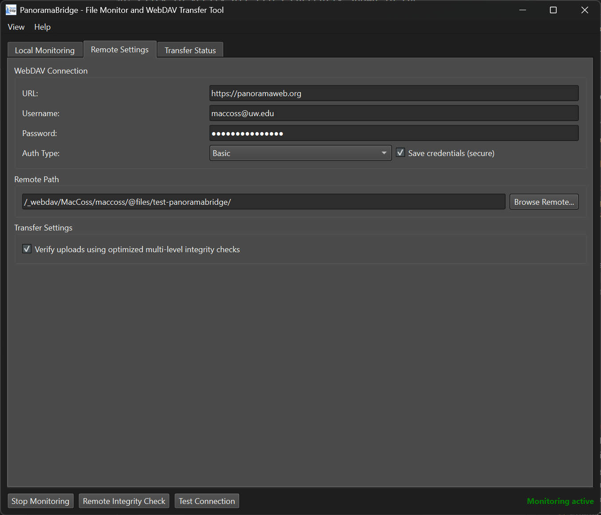
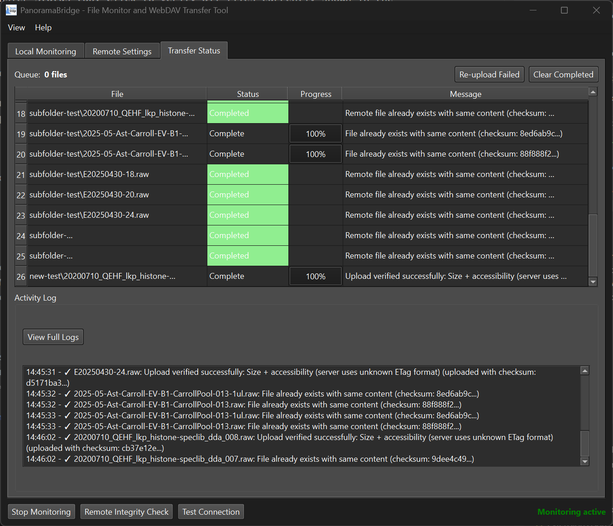

# PanoramaBridge

A Python Qt6 application for monitoring local directories and automatically transferring files to Panorama WebDAV servers. This tool provides real-time file monitoring with secure credential storage and robust upload capabilities.

## Features

- **Real-time File Monitoring**: Automatically detects new files in specified directories
- **WebDAV Integration**: Seamless integration with Panorama WebDAV servers
- **Secure Credential Storage**: Uses system keyring for safe password storage
- **Chunked Upload**: Efficient handling of large files with progress tracking
- **Directory Structure Preservation**: Maintains folder hierarchy on remote server
- **Remote Directory Browser**: Navigate and create folders on the WebDAV server
- **Comprehensive Logging**: Detailed logs with menu-based access for troubleshooting
- **Cross-platform**: Works on Windows, Linux, and macOS

## Requirements

### Python Dependencies

The `requirements.txt` file includes all necessary dependencies:

```
PyQt6>=6.4.0
watchdog>=3.0.0
requests>=2.31.0
keyring>=24.0.0
keyrings.alt>=5.0.0
```

## Installation Steps

### 1. Install Python

- Download Python 3.9 or later from [python.org](https://www.python.org/)
- During installation, check "Add Python to PATH"

### 2. Create Virtual Environment (Recommended)

```bash
# Create virtual environment
python -m venv .venv

# Activate it
# On Windows:
.venv\Scripts\activate
# On Linux/Mac:
source .venv/bin/activate
```

### 3. Install Dependencies

```bash
pip install -r requirements.txt
```

### 4. Run the Application

```bash
python panoramabridge.py
```

## Quick Start

1. **Launch the application**: `python panoramabridge.py`
2. **Configure WebDAV connection**: 
   - Go to "Remote Settings" tab
   - Enter your Panorama server URL (e.g., `https://panoramaweb.org`)
   - Add your username and password
   - Click "Test Connection" to verify
3. **Set up monitoring**:
   - Go to "Local Monitoring" tab
   - Select directory to monitor
   - Specify file extensions (e.g., `raw, sld, csv`)
   - Choose remote destination folder
4. **Start monitoring**: Click "Start Monitoring"
5. **View progress**: Check "Transfer Status" tab for real-time updates

## Creating a Windows Executable (Optional)

To create a standalone .exe file:

### 1. Install PyInstaller

```bash
pip install pyinstaller
```

### 2. Create the Executable

```bash
pyinstaller --onefile --windowed --name "PanoramaBridge" panoramabridge.py
```

The executable will be in the `dist` folder.

## User Interface

### Local Monitoring Tab

- **Directory Selection**: Choose the local folder to monitor for new files
- **File Extensions**: Specify which file types to monitor (e.g., `raw, sld, csv, txt`)
- **Subdirectory Monitoring**: Option to include all subfolders
- **Directory Structure**: Preserve local folder structure on remote server
- **File Stability**: Configure how long to wait before considering a file complete


### Remote Settings Tab

- **WebDAV Connection**: Configure Panorama server connection
  - URL: Your Panorama server (e.g., `https://panoramaweb.org`)
  - Authentication: Username and password with secure storage option
  - Connection testing with automatic endpoint detection
- **Remote Path Selection**: Browse and select destination folders
- **Transfer Settings**: Configure chunk size for optimal performance
- **Upload Verification**: Enable/disable post-upload integrity checking



### Transfer Status Tab

- **Queue Monitor**: See how many files are waiting for transfer
- **Progress Tracking**: Real-time progress bars for active uploads
- **Activity Log**: Timestamped events and error messages
- **Log Access**: View → View Application Logs for detailed troubleshooting



## Application Features

### File Monitoring

- **Real-time Detection**: Monitors for new files as they're created
- **File Stability Check**: Waits until files are fully written before transfer
- **Extension Filtering**: Only processes files with specified extensions
- **Subdirectory Support**: Optional recursive monitoring

### WebDAV Transfer

- **Chunked Upload**: Handles large files efficiently with configurable chunk sizes
- **Progress Tracking**: Real-time progress bars for each transfer
- **Checksum Verification**: Calculates SHA256 checksums for integrity with post-upload verification
- **Upload Integrity Check**: Downloads and verifies files < 50MB, uses ETag/size comparison for larger files
- **Directory Structure**: Option to preserve local folder structure on remote
- **Automatic Retry**: Robust error handling and connection management

### Security & Credentials

- **Secure Credential Storage**: Uses system keyring for safe password storage
- **Support for Basic and Digest authentication**
- **No plaintext password storage**
- **Cross-platform keyring support with fallback options**

### Remote Directory Management

- **Remote Browser**: Navigate WebDAV directories with GUI
- **Folder Creation**: Create new folders on the remote server
- **Visual Directory Tree**: Easy navigation and selection
- **Path Selection**: Select destination paths intuitively

## Menu System

- **View Menu**:
  - **View Application Logs**: Access detailed logs for troubleshooting
- **Help Menu**:
  - **About**: Application information and log file location

## Configuration

Settings are automatically saved in:

- **Windows**: `%USERPROFILE%\.panoramabridge\config.json`
- **Linux/Mac**: `~/.panoramabridge/config.json`

Credentials are stored securely in the system keyring.

Application logs are saved to: `panoramabridge.log`

## Troubleshooting

### Common Issues

#### Connection Problems

1. **"Connection Failed" Error**
   - Verify Panorama server URL (usually `https://panoramaweb.org`)
   - The application automatically tries `/webdav` endpoint if needed
   - Check username and password
   - Try both Basic and Digest authentication types
   - Ensure server is accessible from your network

2. **Keyring/Credential Storage Issues**
   - If you see "keyring backend not available" errors:
     - The application automatically installs `keyrings.alt` package
     - Restart the application after installation
     - Credentials will be saved securely on subsequent attempts

#### File Monitoring Issues

3. **Files Not Being Detected**
   - Verify directory path is correct and accessible
   - Check file extensions match exactly (case-insensitive)
   - Ensure files are being created in the monitored directory
   - Check subdirectory monitoring setting if files are in subfolders
   - File stability timeout may need adjustment for large files

#### Upload Problems

4. **Upload Verification Issues**
   - **"Verification failed" after successful upload**: 
     - Check network stability during verification download
     - For files > 50MB, verification uses size/ETag comparison only
     - Disable verification in Transfer Settings if experiencing frequent issues
     - Manual verification: Compare file sizes and download checksums separately
   - **Slow upload verification**:
     - Verification downloads small files (< 50MB) to verify checksums
     - Large files use faster ETag/size comparison
     - Disable verification for maximum upload speed (less secure)

5. **Folder Creation Failures (HTTP 403)**
   - **Permission Denied**: Most common issue
   - Contact your Panorama administrator to request write permissions
   - Try creating folders in directories where you have write access
   - Check if you're in the correct user directory path

5. **Path Encoding Issues (HTTP 409 - Path Conflict)**
   - **Special Characters in Directory Names**: Fixed in current version
   - Previously, directories with `@` symbols (like `@files`) could cause encoding issues
   - The application now properly handles URL encoding/decoding for special characters
   - If you encounter path conflicts, try refreshing the directory listing

6. **Upload Failures**
   - Check available space on Panorama server
   - Verify write permissions for the selected remote path
   - Try reducing chunk size for problematic connections
   - Check network connectivity and stability
   - Monitor the application logs via View → View Application Logs

#### Performance Issues

7. **Large File Problems**
   - Increase chunk size to 50-100MB for files >1GB
   - Ensure stable network connection
   - Check server timeout settings
   - Monitor system memory usage during transfers

### Panorama-Specific Notes

#### Server Configuration

- **Panorama WebDAV Endpoint**: Typically `/webdav` (auto-detected)
- **Authentication**: Usually Basic authentication
- **File Types**: Commonly used for `.raw`, `.mzML`, `.mzXML`, `.wiff` files
- **Directory Structure**: Often organized by project/experiment

#### Permissions

- Write access must be granted by Panorama administrators
- Users typically have access to their own directories
- Project-specific permissions may apply
- Contact your Panorama administrator for access issues

### Logging and Diagnostics

#### Accessing Logs

1. **In-Application**: View → View Application Logs
2. **Log File**: `panoramabridge.log` in the application directory
3. **Activity Tab**: Real-time events in the Transfer Status tab

#### What to Include in Support Requests

1. Complete error messages from the application logs
2. Panorama server URL and username (no passwords)
3. File types and sizes being transferred
4. Network configuration details
5. Steps to reproduce the issue

### Performance Optimization

#### For Large Files (>1GB)

- Increase chunk size to 50-100MB
- Use wired network connection
- Transfer during off-peak hours
- Monitor system resources

#### For Many Small Files

- Keep default 10MB chunk size
- Monitor queue size in Transfer Status tab
- Consider organizing files into batches

#### Network Optimization

- Use stable, high-bandwidth connection
- Check for network restrictions or firewalls
- Monitor server load and availability
- Consider VPN if accessing from outside institution

## Support and Resources

### Getting Help

1. **Application Logs**: First check View → View Application Logs for detailed error information
2. **Test Connection**: Verify settings with the "Test Connection" button
3. **Panorama Documentation**: Refer to your institution's Panorama setup guide
4. **Administrator Contact**: Reach out to your Panorama administrator for permissions

### Common File Types for Panorama

- **Mass Spectrometry**: `.raw`, `.wiff`, `.mzML`, `.mzXML`
- **Xcalibur Sequences**: `.sld` (Sequence documents)
- **Proteomics**: `.fasta`, `.csv`, `.tsv`, `.txt`
- **Analysis Results**: `.pdf`, `.xlsx`, `.zip`


